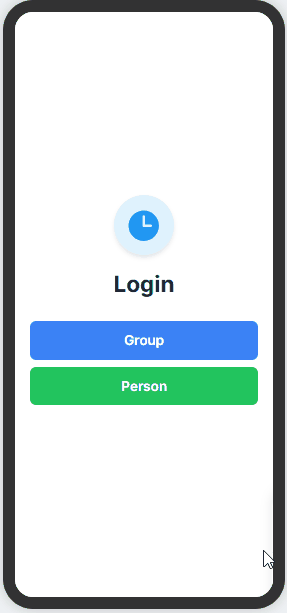

# Good Deeds

 an app for people to go on to give community service opportunities 
 
The following features are implemented in the project:

- [ ] gives the place and the times
- [ ] profile based
- [ ] can put the community service you found on the app
- [ ] can give a spreadsheet of community service you have done
- [ ] can have groups that you can join where they recommend or show upcoming community services you can do with that group, Ex. School group(can have clubs within the school under it), work groups, etc.
- [ ] own profile where you can put all of the community service you have done
- [ ] can add community service oppurtunities to a todo list for reminder
- [ ] Map section of all the homeless and resource shelters to allow donation. w/demographics of the amount of homeless and the amount of poor people in each place.

## Project Design:

Here's a mockup and design of the project:

## video waltkthrough:

Here's a walkthrough of implemented features:

## Notes and Comments
I will continue to work on this app especially The profiles to make distinct changes between the personal and group pages
Challenges: getting Gemini to output what I exactly what I wanted.
